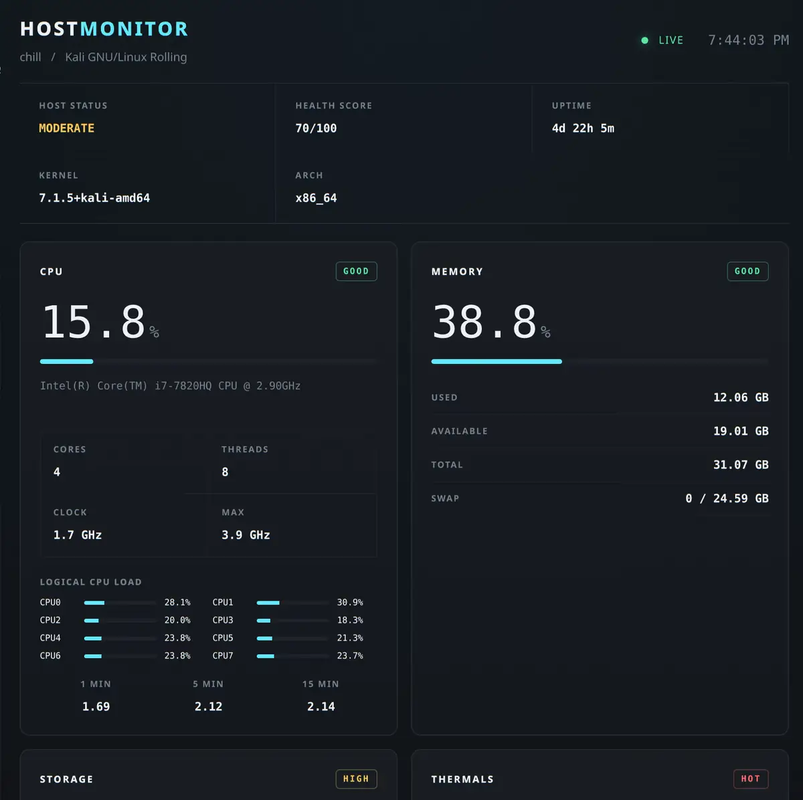
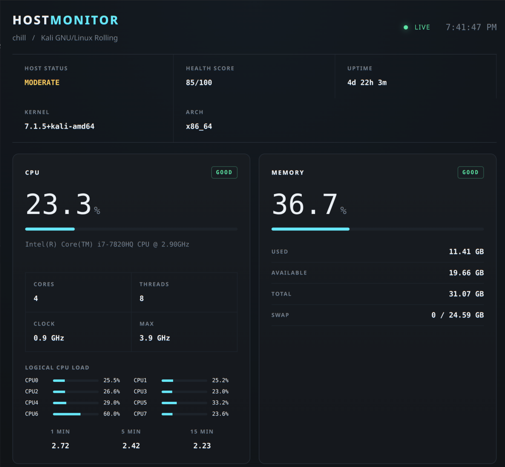
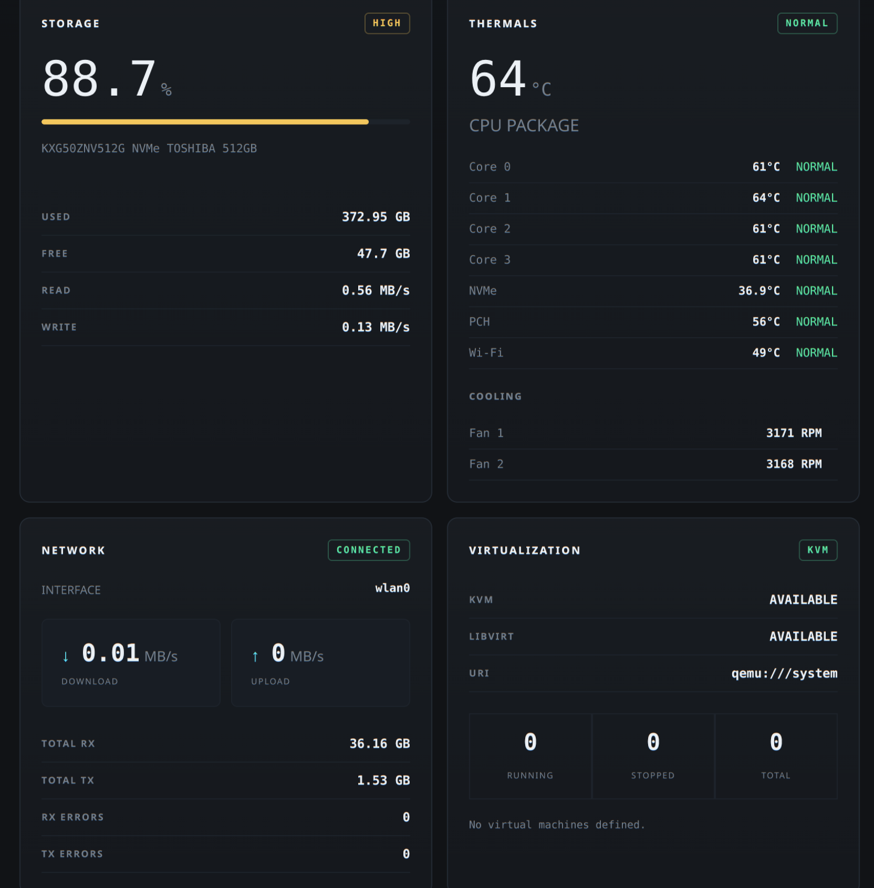
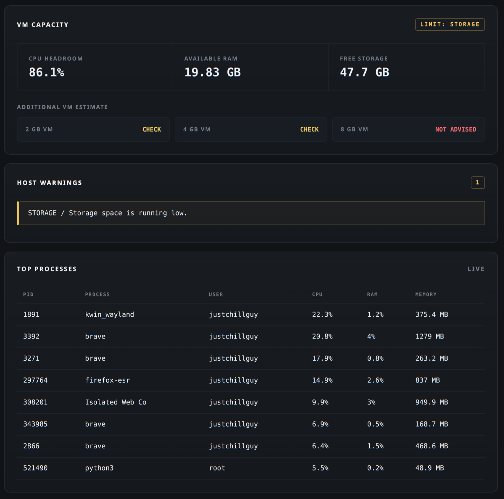

# HostMonitor

HostMonitor is a lightweight, real-time monitoring dashboard for **Linux hosts**.

It provides a simple web interface for monitoring CPU, memory, storage, temperatures, network activity, Docker containers, KVM/libvirt virtual machines, running processes, and available VM capacity.

It is designed for Linux workstations, homelabs, and systems running multiple virtual machines or containers.

---

## Demo



---

## Dashboard

### System Overview



### Resource & Virtualization Monitoring



### Processes & Host Details



---

## Features

* Real-time CPU usage
* Per-thread CPU utilization
* CPU frequency and load average
* RAM and swap monitoring
* CPU and individual core temperatures
* NVMe temperature monitoring
* PCH and Wi-Fi temperatures when available
* Fan RPM monitoring
* Storage usage
* Live disk read/write activity
* Network upload and download activity
* Docker container monitoring
* KVM/libvirt virtual machine monitoring
* Top running processes
* System uptime and host information
* Host health warnings
* VM capacity estimation

---

## How It Works

HostMonitor runs directly on the Linux machine being monitored.

The backend collects system information using Python and `psutil`, along with Linux system interfaces and optional services such as `lm-sensors`, Docker, and libvirt.

```text
                 Linux Host
                     │
       ┌─────────────┼─────────────┐
       │             │             │
      CPU           RAM         Storage
       │             │             │
   Thermals       Network        Docker
       │             │             │
       └─────────────┼─────────────┘
                     │
                KVM / libvirt
                     │
                     ▼
              Python Collectors
                     │
                     ▼
                  Flask
                     │
                     ▼
              /api/overview
                     │
                     ▼
              Web Dashboard
```

The Flask backend collects the latest system metrics and exposes them through the `/api/overview` endpoint.

The dashboard requests this endpoint every few seconds and updates the interface automatically without requiring a page refresh.

---


# Installation

HostMonitor currently supports **Linux**.

The following instructions are intended for Debian-based distributions such as **Debian, Ubuntu, and Kali Linux**.

## 1. Clone the Repository

```bash
git clone https://github.com/ShivkumarChougala/hostmonitor.git
cd hostmonitor
```

## 2. Install System Dependencies

```bash
sudo apt update
sudo apt install python3 python3-venv lm-sensors
```

## 3. Configure Hardware Sensors

Run:

```bash
sudo sensors-detect
```

Follow the prompts to detect the available hardware sensors.

Verify that the sensors are working:

```bash
sensors
```

You should see available temperatures and fan information depending on your hardware.

## 4. Create a Virtual Environment

```bash
python3 -m venv venv
```

Activate it:

```bash
source venv/bin/activate
```

## 5. Install Python Dependencies

```bash
pip install -r requirements.txt
```

## 6. Run HostMonitor

```bash
python app.py
```

The Flask server should start on port `5000`.

Open the dashboard:

```text
http://127.0.0.1:5000
```

---

## Access From Another Device

HostMonitor can also be accessed from another device connected to the same local network.

Find the IP address of the Linux host:

```bash
hostname -I
```

For example:

```text
192.168.1.6
```

Open the following address from another device:

```text
http://192.168.1.6:5000
```

Replace `192.168.1.6` with the actual IP address of your Linux host.

---

## Compatibility

HostMonitor is currently designed for **Linux**.

Some functionality depends on software or hardware available on the host:

| Feature          | Requirement                 |
| ---------------- | --------------------------- |
| CPU / RAM        | Linux + psutil              |
| Storage          | Linux + psutil              |
| Network          | Linux + psutil              |
| Temperatures     | lm-sensors / kernel sensors |
| Fan RPM          | Supported hardware sensors  |
| Docker           | Docker installed            |
| Virtual Machines | KVM + libvirt               |
| VM Capacity      | Host resource metrics       |

Not every Linux system exposes the same thermal or fan sensors.

---

## Security Note

HostMonitor currently runs using Flask's development server.

It is recommended to use it only on a trusted local network during development.

**Do not expose the Flask development server directly to the public internet.**

---

## Author

**Shivkumar Chougala**

GitHub: [ShivkumarChougala](https://github.com/ShivkumarChougala)
